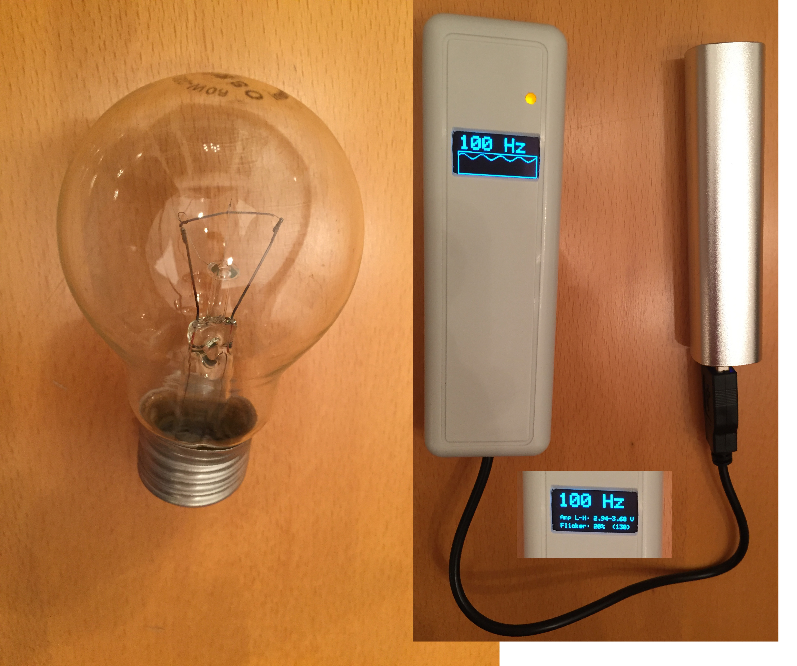
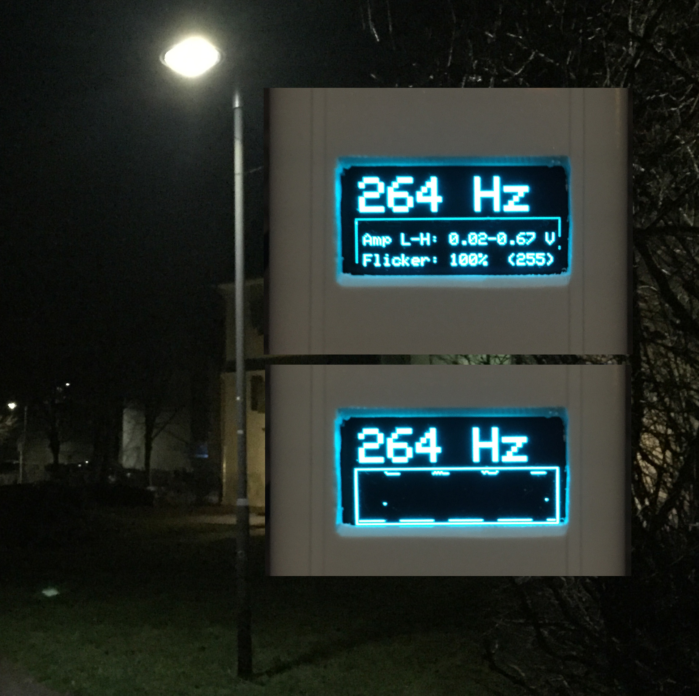
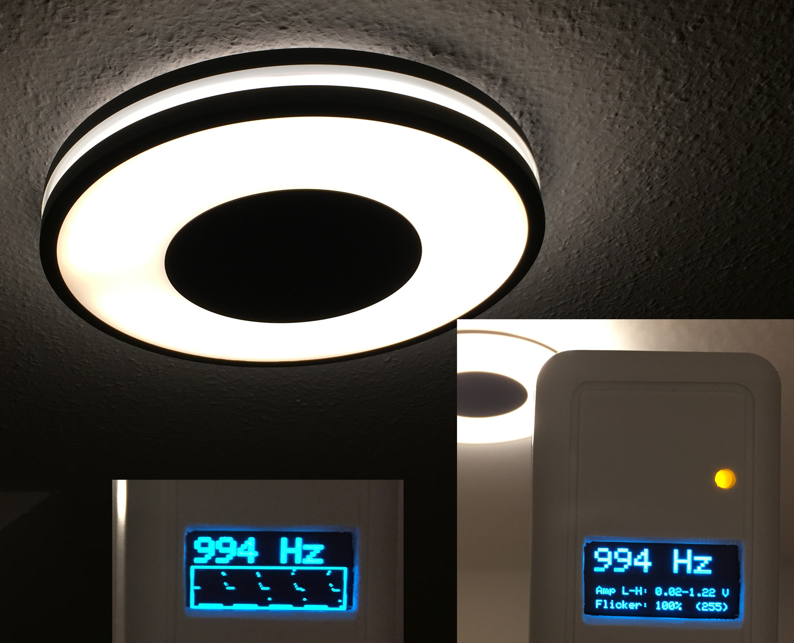
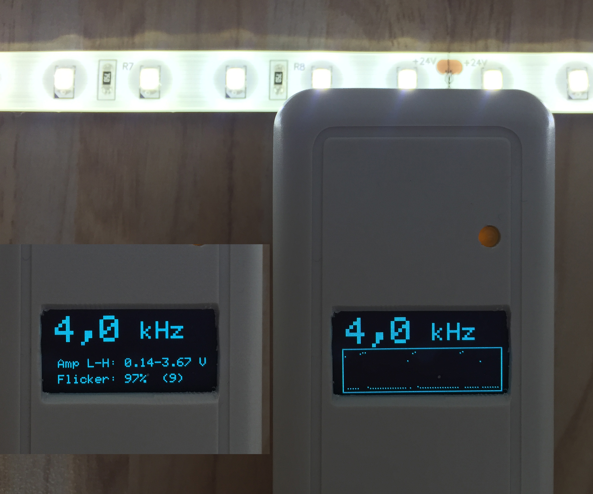
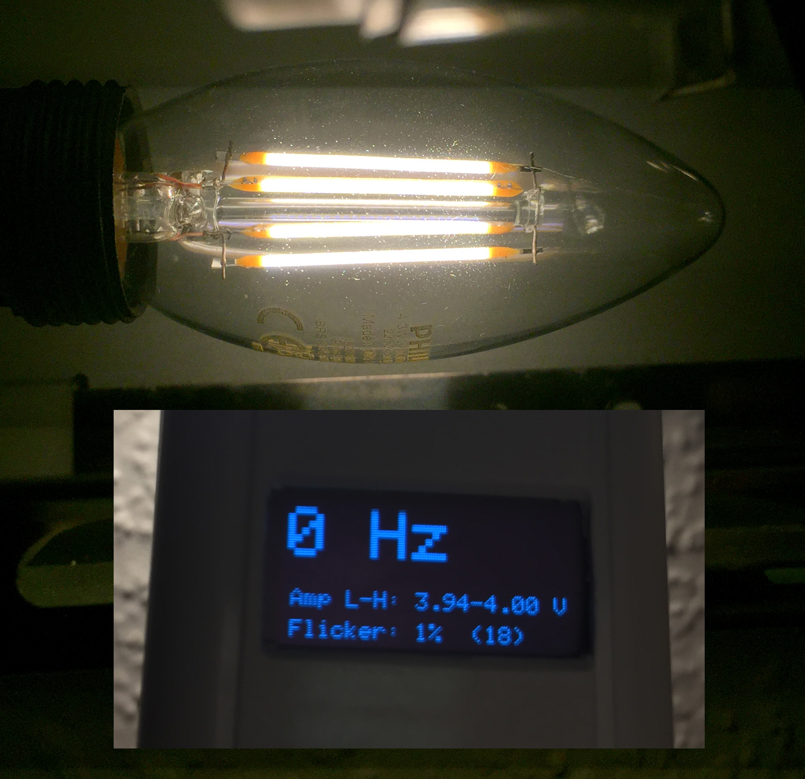

# LightFlickerMeasure
Measures flickering lights, like PWM driven LED-systems, using Arduino.

An old Light Bulb sends 80% constant light and a 20% sine waveform as 100 Hz noise ontop, so no flicker is recognized.

This LED Streetlamp sends a permanent PWM of 264 Hz frequency instead of a steady light! Going for a walk at night, this lamp is really annoying.

Philips Hue Being ceiling light and also the Philips Hue Light Strip+, as well as my Philips Hue RGB light bulbs, run at 1 kHz PWM. That still flickers irritatingly in your eyes when looking around in your appartment.

Talking about LED strips, the Paulmann SimpLED-Strip Set (789.56) dims in the PWM frequency range of 2,5 to 4 kHz. Covered by an opaque plastic housing, this could be considered it as less to no flicker. But if you install the strip in direkt sight, a strong flicker will be recognized when moving head or eyes.

Totally smooth light sent by a Philips Filament Bulb (not dimmable), I really enjoy it.

